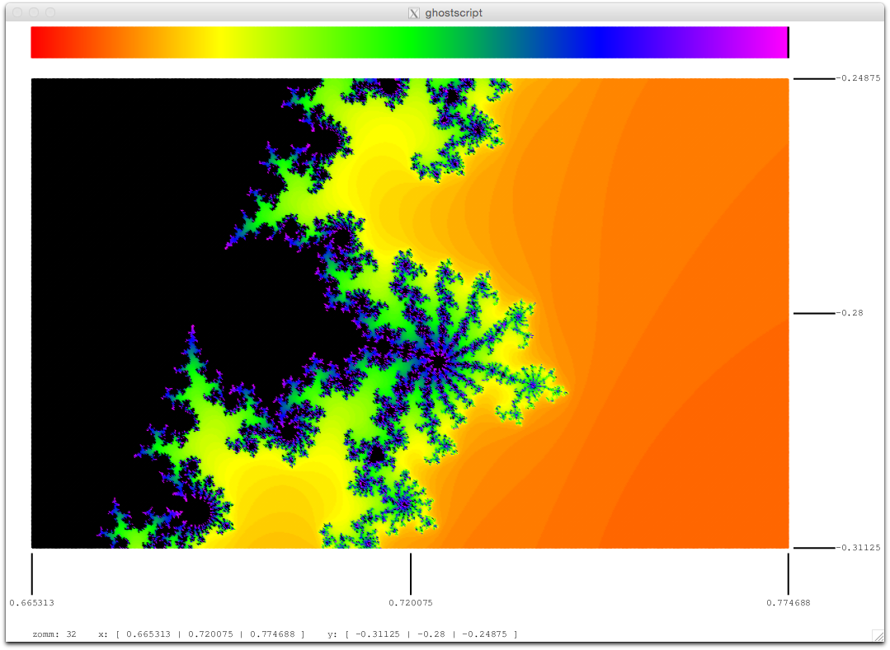
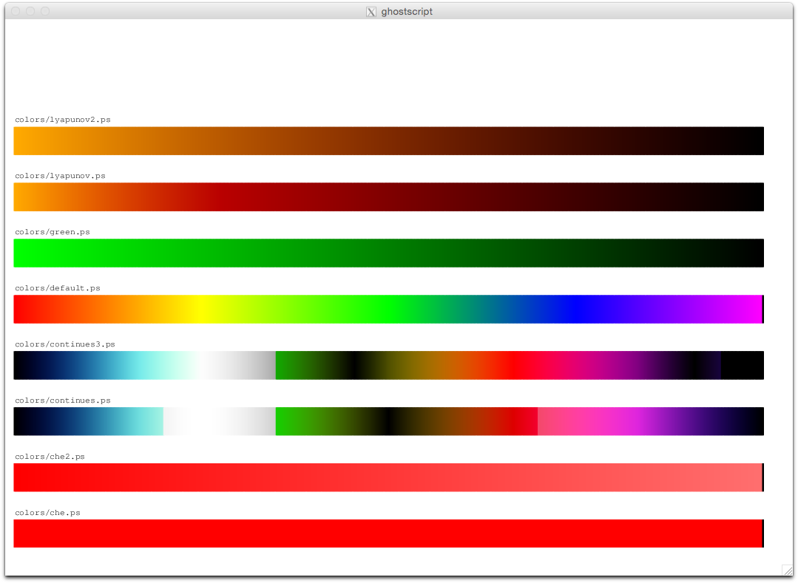

# Fractals with interpreted interate and escape function

## Translate
First part translates an formula from infix notation to postfix notation.

This tokens ...

binary_operator

    % complex operators
    dup (++) eq { tok_cadd }{
    dup (--) eq { tok_csub }{
    dup (**) eq { tok_cmul }{
    dup (//) eq { tok_cdiv }{

    % basic operators
    dup (+)  eq { tok_add }{
    dup (-)  eq { tok_sub }{
    dup (*)  eq { tok_mul }{
    dup (/)  eq { tok_div }{

unary_postfix_operator

    % complex operators
    dup (^^2) eq { tok_csqr }{
    dup (^^3) eq { tok_ccub }{

unary_operator

    % complex operators
    dup (||)  eq { tok_cabs }{
    dup (|/)  eq { tok_cria }{

... get translated into this postscript functions ...

    /tok_cadd [5100 (complex_add)] def
    /tok_csub [5101 (complex_sub)] def
    /tok_cmul [5310 (complex_mul)] def
    /tok_cdiv [5311 (complex_div)] def

    /tok_csqr [7000 (complex_sqr)] def
    /tok_ccub [7000 (complex_cub)] def

    /tok_cabs [6000 (complex_abs)] def
    /tok_cria [6000 (complex_ri_abs)] def

    /tok_add [4110 (add)] def
    /tok_sub [4111 (sub)] def
    /tok_mul [4310 (mul)] def
    /tok_div [4311 (div)] def

## Configuration

    ( 1) /wh_point_step { 2 } def                %% x y step 
    ( 2) /wh_scale { 1 div floor cvi } def       %% scale whole image
    
    ( 3) /width  { 725 wh_scale } def            %% fractal width
    ( 4) /height { 450 wh_scale } def            %% fractal height
    
    ( 5) /center_y   -0.28 def                   %% x center of view in complex area
    ( 6) /center_x   0.72 def                    %% y center of view in complex area
    ( 7) /zoom       32 def                      %% zoom level of view
    
    ( 8) /color_map       (default) def          %% definitions from colors directory
    ( 9) /iterate_maximum 100 def                %% recusion escape value
    (10) /limit_value     4   def                %% limit of z
    
    (11) (z ^^2 ||) tokenize parse codegen
         /limit_formula exch def
    
    (12) (z ^^2 -- c) tokenize parse codegen
    	 /iterate_formula exch def
        </code>

#### tokenize
Separates the input string into tokens. 
A token is an 2 dimensional array consisting of a tok_id and a text. 
The tok_id is also interpreted as an operator precedence, which is important for the parse process.

    (z ^^2 ++ c) tokenize
    [10 (z)] [7000 (complex_sqr)] [5100 (complex_add)] [10 (c)]
    					
#### parse
Parses the tokens into a syntax tree representation.

    [10 (z)] [7000 (complex_sqr)] [5100 (complex_add)] [10 (c)] parse
    [10 (z)] [7000 (complex_sqr)] [10 (c)] [5100 (complex_add)]
    					
#### codegen
Translates the calculus operations into postscript functions. The postscript functions are located in lib/complex.ps

    [10 (z)] [7000 (complex_sqr)] [10 (c)] [5100 (complex_add)] codegen
    (zr zi complex_sqr cr ci complex_sub)

### Point Step

### Color Map

### Zoom / Center X Y

 

 

## Makefile

Important goals: mb cbs color_test test

    make mb
    make cbs
    make color_test
    make test

## Color Test

